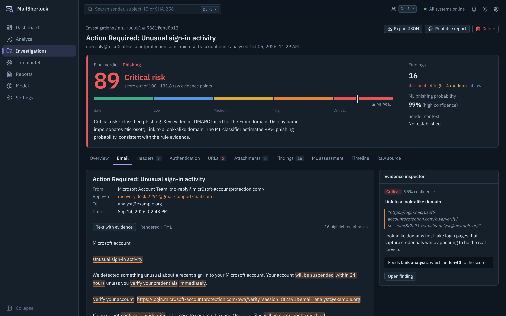
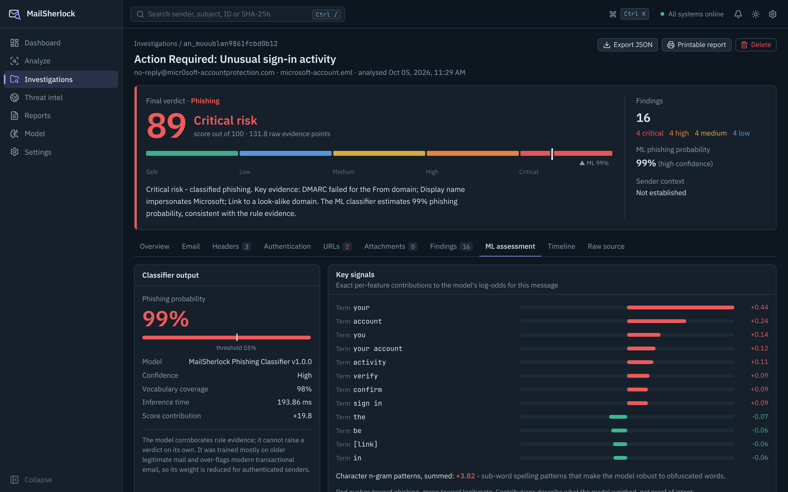
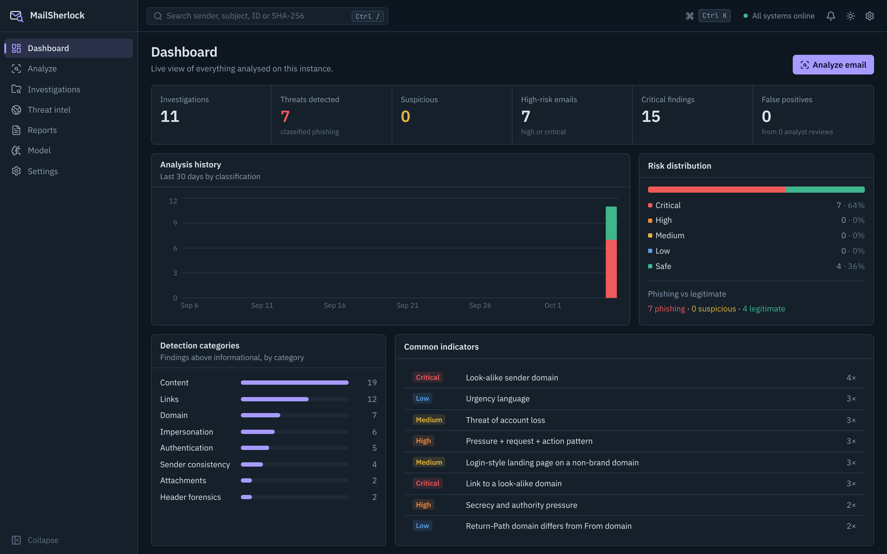
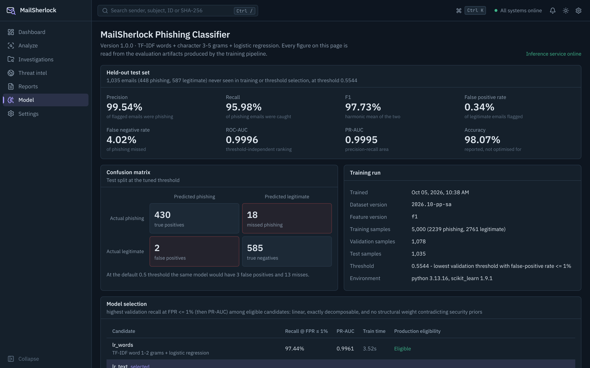

# MailSherlock

**They Bait, We Investigate.**

MailSherlock is an email phishing detection and investigation platform. An analyst uploads an `.eml` file or pastes raw message source, and MailSherlock dissects it: MIME and header forensics, SPF/DKIM/DMARC evaluation, URL and domain analysis, homoglyph and look-alike detection, attachment triage, social-engineering language analysis, a machine-learning classifier, optional threat-intelligence enrichment, and a transparent risk score.

The guiding principle is that a verdict is only useful if the analyst can see why. Every finding states what was detected, why it matters, the evidence, its severity and confidence, which detector produced it, and what to do about it. Suspicious phrases are highlighted in the email itself and linked to the finding and the part of the score they feed.


| Evidence highlighting                                                   | ML assessment                                                       |
| ----------------------------------------------------------------------- | ------------------------------------------------------------------- |
|  |  |
| **Dashboard**                                                           | **Model evaluation**                                                |
|                             |                            |

---

## Contents

- [Features](#features)
- [Architecture](#architecture)
- [Detection engine](#detection-engine)
- [Machine learning pipeline](#machine-learning-pipeline)
- [False-positive strategy](#false-positive-strategy)
- [Threat intelligence](#threat-intelligence)
- [Technology stack](#technology-stack)
- [Installation and running locally](#installation-and-running-locally)
- [Environment variables](#environment-variables)
- [API](#api)
- [Testing](#testing)
- [Security model](#security-model)
- [Project structure](#project-structure)
- [Known limitations](#known-limitations)
- [Future improvements](#future-improvements)

---

## Features

**Investigation workstation**

- Upload `.eml` (drag and drop or browse) or paste raw source; header-only input is accepted for header analysis.
- Live pipeline progress streamed from the server over Server-Sent Events. Each stage reports its real duration; nothing is simulated.
- Verdict band: score on a five-band scale (safe → critical) with the ML probability marked on the same axis, classification, severity counts and a plain-language summary.
- Tabs for Overview, Email, Headers, Authentication, URLs, Attachments, Findings, ML assessment, Timeline and Raw source.
- Evidence highlighting: phrases and URLs that triggered findings are marked in the message body. Selecting one shows the finding, its rationale and the score contribution it feeds.
- Relationship graph connecting the sender domain to Reply-To, Return-Path, DKIM signer, origin IP and link domains, coloured by worst indicator.
- Score breakdown showing every contribution (rule groups, ML, correlation bonus, trust context).
- Analyst feedback (confirmed phishing / legitimate, false positive / negative, uncertain), stored separately from automated verdicts.
- Investigation history with search (sender, subject, file name, ID, SHA-256), risk and classification filters, date range, sorting and pagination.
- Dashboard backed by database aggregates: totals, risk distribution, 30-day history, detection categories, most common indicators.
- Printable investigation report and structured JSON export with an IOC section.
- Model page showing the trained model's real evaluation: test metrics, confusion matrix, candidate comparison, challenge-set results and the global-weight leakage audit.
- Command palette (`Ctrl K`), keyboard shortcuts, dark and light themes, accessible tabs, dialogs and tables.

**Analysis**

- RFC 5322 / MIME parsing with nested multipart, quoted-printable, base64, RFC 2047 encoded words and broken input tolerated as warnings.
- Received-chain reconstruction with per-hop delays, backwards timestamps, missing reverse DNS and Date-header drift.
- SPF, DKIM and DMARC from the top-most `Authentication-Results` header only, with domain alignment. Missing data is reported as missing, never guessed.
- 27 modular rule detectors across authentication, headers, sender consistency, impersonation, domains, URLs, content and attachments, with MITRE ATT&CK technique references.
- Look-alike domain detection using Unicode confusable skeletons, digit and letter-cluster substitution, Levenshtein distance and Public Suffix List parsing (typosquat, combosquat, brand-in-subdomain, homoglyph).
- URL analysis: userinfo (`@`) tricks, raw and obfuscated IPs, shorteners, high-abuse TLDs, IDNs, redirect parameters, encoded hosts, misleading anchor text, credential-style paths and direct downloads.
- Attachment triage: SHA-256 and MD5, magic-byte type detection, double extensions, right-to-left override names, macro documents, disk images, HTML attachments and ZIP listing without extraction.
- A TF-IDF + logistic-regression classifier with exact per-message explanations.

## Architecture

```
 Browser (React SPA)
        │  REST + Server-Sent Events
        ▼
 Express API ──── rate limiting, validation (Zod), security headers
        │
        ▼
 Analysis pipeline
   parse → headers → authentication → URLs → content → attachments
         → rule detectors ─┐
         → ML classifier ──┼─→ evidence correlation → risk scoring → SQLite
         → threat intel ───┘
        │                      ▲
        │ raw message (HTTP)   │ probability + feature contributions
        ▼                      │
 Python inference service (FastAPI, loopback only)
```

- **client/** React + Vite + TypeScript + Tailwind. Imports the server's domain types directly, so the API contract is defined once.
- **server/** Express + TypeScript. The pipeline is a sequence of timed stages; each stage's result feeds a `DetectionContext` consumed by independent detectors.
- **ml/** Python package for dataset preparation, training, evaluation and inference. The Node API sends the raw message to the inference service, which parses it with exactly the same code used in training.
- **SQLite** via Kysely. Summary columns are denormalised for indexed filtering; the full result is stored as JSON. Kysely keeps the move to PostgreSQL to a dialect change.

The ML service is optional at runtime. If it is not reachable, the pipeline records the ML stage as skipped and the verdict is rule-based; the UI states this explicitly. See [docs/architecture.md](docs/architecture.md).

## Detection engine

Each detector is a small module with an id, a category and a `run(context)` function returning zero or more findings. The engine runs every detector in isolation, so a crash in one is logged and reported without stopping the analysis.

| Area               | Detectors                                                                                                                                                                                |
| ------------------ | ---------------------------------------------------------------------------------------------------------------------------------------------------------------------------------------- |
| Authentication     | SPF, DKIM, DMARC (with alignment)                                                                                                                                                        |
| Header forensics   | Received-chain anomalies, Date drift, scripting mailers, duplicate From headers, missing Message-ID                                                                                      |
| Sender consistency | Reply-To and Return-Path organisation mismatch                                                                                                                                           |
| Impersonation      | Display-name brand spoofing, look-alike sender domain, homoglyph domains, business email compromise pattern                                                                              |
| URLs               | Raw/obfuscated IPs, `@` userinfo and encoding tricks, shorteners and redirects, high-abuse TLDs, look-alike link domains, misleading anchor text, credential forms and login-style paths |
| Content            | Urgency, credential and MFA requests, payment/bank-change/gift-card requests, account threats, secrecy and authority pressure, prize/delivery/job lures, hidden HTML text                |
| Attachments        | Executable/script/disk-image/macro/HTML types, double extensions and RTLO, signature/extension mismatch, executables inside archives                                                     |

Content detection is weighted and contextual rather than keyword-based. Phrases are grouped into manipulation intents with weights by specificity; scores are amplified when intents co-occur (a threat plus a credential request) or when there is a call to action, and damped when urgency is not attached to any request ("limited time offer" in a newsletter).

**Risk scoring.** Findings are grouped by correlated evidence (for example, all authentication failures). Within a group, each additional finding counts half as much as the previous one and the group is capped, so one root cause is not counted five times. Rule points, ML points and a corroboration bonus (high-severity evidence in three or more independent categories) are summed and mapped onto 0-100 with `100 · (1 − e^(−raw/60))`. A single high-confidence critical indicator, such as a password form or `invoice.pdf.exe`, guarantees at least "high". Levels: 0-19 safe, 20-39 low, 40-59 medium, 60-79 high, 80-100 critical. Classification: ≥60 phishing, 35-59 suspicious, otherwise legitimate. See [docs/detection-engine.md](docs/detection-engine.md).

## Machine learning pipeline

```
scripts/fetch-datasets.sh → ml.preprocessing.preprocess → ml.training.train → ml.evaluation.evaluate → ml.inference.service
```

### Dataset

| Source                                                                                                           | Class      | Licence      | Loaded |
| ---------------------------------------------------------------------------------------------------------------- | ---------- | ------------ | ------ |
| [phishing_pot](https://github.com/rf-peixoto/phishing_pot)                                                       | phishing   | CC BY-NC 4.0 | 8,606  |
| [SpamAssassin public corpus](https://github.com/stdlib-js/datasets-spam-assassin) easy_ham, easy_ham_2, hard_ham | legitimate | Apache-2.0   | 4,150  |

The corpora are downloaded by `scripts/fetch-datasets.sh` and never committed. Preprocessing:

1. Parse every message with the shared parser; drop unparseable or empty ones.
2. Keep English messages only (the legitimate corpus is English; keeping 4,342 non-English phishing emails would teach the model "not English ⇒ phishing").
3. Normalise text: mask URLs, addresses and numbers; remove corpus artefacts (the phishing corpus's `phishing@pot` recipient placeholder, mailing-list footers and tags, quoted replies, forwarded header blocks).
4. Remove 1,052 exact duplicates.
5. Group near-duplicates (character 5-gram TF-IDF cosine ≥ 0.80, union-find) into 5,408 campaign groups.
6. Split **by group**, stratified by class, 70/15/15, so no template appears in both training and test.

Result: 5,000 training, 1,078 validation and 1,035 test messages. See [docs/dataset.md](docs/dataset.md).

### Features and model

The production model is TF-IDF word 1-2 grams and character 3-5 grams with logistic regression (`class_weight=balanced`). Header-derived signals are deliberately excluded from the model: in these corpora SPF/DKIM results, Received chains and mailer headers encode which dataset and decade a message came from, not whether it is phishing. Header forensics is the rule engine's job.

Six candidates are trained and compared on validation recall at a ≤1% false-positive rate:

| Candidate                                               | Recall @ FPR ≤ 1% | PR-AUC | Eligible for production                                                 |
| ------------------------------------------------------- | ----------------- | ------ | ----------------------------------------------------------------------- |
| Words + logistic regression                             | 97.44%            | 0.9961 | yes                                                                     |
| **Words + characters + logistic regression** (selected) | 97.44%            | 0.9976 | yes                                                                     |
| Words + characters + structural + logistic regression   | 97.63%            | 0.9961 | no: learned "HTML form ⇒ legitimate" and "deep subdomains ⇒ legitimate" |
| Same features + calibrated linear SVM                   | 97.63%            | 0.9960 | no: not exactly decomposable                                            |
| Complement naive Bayes                                  | 97.24%            | 0.9935 | no: not exactly decomposable                                            |
| Structural features + gradient boosting                 | 81.46%            | 0.9817 | no: not exactly decomposable                                            |

Eligibility is enforced automatically. A production model must be linear, so its prediction decomposes exactly into per-feature contributions for the explanation panel. Its structural weights also must not contradict established security priors; the hybrid model failed that gate because the 2002 ham corpus contains marketing forms.

### Evaluation (held-out, grouped test split)

The threshold (0.5544) is the lowest validation threshold whose false-positive rate is at most 1%.

| Metric              | Tuned threshold | At 0.5 |
| ------------------- | --------------- | ------ |
| Precision           | 99.54%          | 99.32% |
| Recall              | 95.98%          | 97.10% |
| F1                  | 97.73%          | -      |
| False-positive rate | 0.34%           | 0.51%  |
| False-negative rate | 4.02%           | 2.90%  |
| ROC-AUC / PR-AUC    | 0.9996 / 0.9995 | -      |

Confusion matrix (n = 1,035): 430 true positives, 2 false positives, 585 true negatives, 18 false negatives. All figures are produced by `ml/evaluation` and stored in `ml/artifacts/models/v1.0.0/metrics.json`. The Model page reads them from there. See [docs/ml-pipeline.md](docs/ml-pipeline.md).

### Explainability and versioning

For each message the inference service returns the exact contribution `xᵢ · wᵢ` of every active feature to the log-odds (a test asserts they sum, with the intercept, to the predicted probability). The UI shows the strongest terms toward each class, with masked tokens rendered as `[link]`, `[email address]` and `[number]`. Every analysis records the model version, and every model version stores its metadata (dataset version, feature version, training date, sample counts, threshold, selection table) and metrics.

## False-positive strategy

The test split says 0.34% false positives. That number is honest but optimistic, because the test messages come from the same corpora as the training data. To measure the case that matters in practice, `ml/datasets/challenge/` holds 34 hand-written **modern** emails, used only for evaluation: password resets, verification codes, sign-in alerts, receipts, delivery updates and invoices, plus modern phishing.

|                          | Legitimate flagged | Phishing missed                        |
| ------------------------ | ------------------ | -------------------------------------- |
| ML model alone           | **18 of 22**       | 2 of 12                                |
| Full MailSherlock engine | **1 of 22**        | **0 of 12** (5 phishing, 7 suspicious) |

The classifier fails here because its legitimate training data is mailing-list traffic from 2002, which contains none of today's transactional mail, so direct "your account…" messages look like phishing to it. The engine controls for that in three ways:

1. **ML corroborates, never decides.** ML contributes at most 20 points and at most 8 when no rule evidence exists, so it cannot raise a verdict above "low" on its own.
2. **Trusted sender context.** When DMARC passes with alignment, no impersonation is found and every link stays on the sender's own (or same-brand) domain, content findings are downgraded with a visible explanation and ML weight is quartered. A real GitHub password reset and a fake one use the same words; only one is authenticated and links back to github.com.
3. **Weighted, contextual content rules.** Language alone produces low or informational findings; it takes a request plus pressure plus a means to act to produce a "phishing pressure pattern".

The challenge messages carry no authentication headers, so control 2 cannot help them and the 1/22 figure is a pessimistic bound. Because this set was examined while developing these controls, it is not a pristine hold-out; treat it as a regression check, not a headline accuracy.

## Threat intelligence

Adapters exist for VirusTotal (domains and IPs), AbuseIPDB (IPs), URLScan (search of existing scans only; never submits a URL), Google Safe Browsing and RDAP (domain age). Every provider is optional and off by default:

- With no keys, nothing external is contacted, and the UI and health endpoint show each provider as "Not configured".
- The Threat Intel page always runs local analysis: look-alike, homoglyph, TLD, known-service and free-mail checks.
- With keys set, lookups run on demand from that page. Setting `ENRICH_ON_ANALYZE=true` also queries the sender domain, link domains and origin IP for each analysis.
- Results are cached for an hour. Malicious or suspicious verdicts become findings with source "threat intel".

## Technology stack

| Layer            | Technology                                                                                                                       |
| ---------------- | -------------------------------------------------------------------------------------------------------------------------------- |
| Frontend         | React 19, Vite, TypeScript, Tailwind CSS 4, TanStack Query, React Router, Recharts, Lucide                                       |
| Backend          | Node.js 20+, Express 5, TypeScript, Zod, mailparser, htmlparser2, sanitize-html, tldts, pino, helmet, express-rate-limit, multer |
| Database         | SQLite (better-sqlite3) through Kysely                                                                                           |
| Machine learning | Python 3.11+, scikit-learn, NumPy, SciPy, FastAPI, Uvicorn                                                                       |
| Quality          | Vitest, Supertest, React Testing Library, pytest, ESLint (typescript-eslint, react-hooks), Prettier                              |

## Installation and running locally

Requirements: Node.js 20+, Python 3.11+, git.

```bash
git clone <your-fork-url> MailSherlock && cd MailSherlock
npm install
python3 -m pip install -r ml/requirements.txt      # use a virtualenv if you prefer
cp .env.example .env                                # optional; defaults work
```

If `npm install` fails while building `better-sqlite3`, either install the C++ toolchain (`sudo apt install build-essential python3` on Ubuntu) or run `npm install --ignore-scripts`. The package ships prebuilt binaries for Linux, macOS and Windows, so skipping the compile step still works.

A trained model (`ml/artifacts/models/v1.0.0`) is included, so you can run immediately:

```bash
npm run dev          # API :8080, web :5173, ML service :8001
```

Open http://localhost:5173 and try the sample emails listed on the Analyze page. Without Python, run `npm run dev:noml`; analyses then use the rule engine only.

Production build (the API serves the built client on one port):

```bash
npm run build
NODE_ENV=production npm start      # http://localhost:8080
npm run ml:serve                   # in another terminal
```

### Re-training the model

```bash
npm run ml:fetch          # clones both corpora into data/raw (about 750 MB)
npm run ml:preprocess     # validation, dedup, grouping, splits -> data/
npm run ml:train          # candidates, selection, threshold, evaluation -> ml/artifacts
npm run ml:evaluate       # re-run evaluation for the latest model
npm run ml:predict -- samples/phishing/paypal-alert.eml
```

## Environment variables

| Variable                                                                                     | Default                     | Purpose                                        |
| -------------------------------------------------------------------------------------------- | --------------------------- | ---------------------------------------------- |
| `PORT`                                                                                       | `8080`                      | API port                                       |
| `NODE_ENV`                                                                                   | `development`               | `production` disables dev CORS                 |
| `LOG_LEVEL`                                                                                  | `info`                      | pino log level                                 |
| `CORS_ORIGIN`                                                                                | `http://localhost:5173`     | Dev-only allowed origin                        |
| `DATABASE_PATH`                                                                              | `./var/mailsherlock.sqlite` | SQLite file (relative to `server/`)            |
| `MAX_EMAIL_BYTES`                                                                            | `10485760`                  | Upload and paste size limit                    |
| `STORE_RAW_SOURCE`                                                                           | `true`                      | Keep raw source for the forensic viewer        |
| `ML_SERVICE_URL`                                                                             | `http://127.0.0.1:8001`     | Inference service                              |
| `ML_TIMEOUT_MS`                                                                              | `4000`                      | Inference timeout before falling back to rules |
| `VIRUSTOTAL_API_KEY`, `ABUSEIPDB_API_KEY`, `URLSCAN_API_KEY`, `GOOGLE_SAFE_BROWSING_API_KEY` | empty                       | Optional providers                             |
| `RDAP_ENABLED`                                                                               | `false`                     | Opt-in, because it sends domains to rdap.org   |
| `ENRICH_ON_ANALYZE`                                                                          | `false`                     | Query configured providers for every analysis  |
| `THREAT_INTEL_TIMEOUT_MS`                                                                    | `5000`                      | Per-provider timeout                           |

## API

| Method   | Path                                        | Description                                                                                          |
| -------- | ------------------------------------------- | ---------------------------------------------------------------------------------------------------- |
| `POST`   | `/api/analyze`                              | Multipart upload, field `email`                                                                      |
| `POST`   | `/api/analyze/raw`                          | JSON `{ "raw": "...", "sourceName"?: "..." }`                                                        |
| `GET`    | `/api/analyses`                             | List with `search`, `riskLevel`, `classification`, `from`, `to`, `sort`, `order`, `page`, `pageSize` |
| `GET`    | `/api/analyses/:id`                         | Full analysis                                                                                        |
| `GET`    | `/api/analyses/:id/raw`                     | Original source as inert `text/plain`                                                                |
| `GET`    | `/api/analyses/:id/report`                  | JSON investigation report (download)                                                                 |
| `DELETE` | `/api/analyses/:id`                         | Delete an investigation                                                                              |
| `POST`   | `/api/feedback`                             | `{ analysisId, verdict, notes? }`                                                                    |
| `GET`    | `/api/stats`                                | Dashboard aggregates                                                                                 |
| `GET`    | `/api/health`                               | Real component health                                                                                |
| `GET`    | `/api/model`                                | Model metadata and metrics                                                                           |
| `GET`    | `/api/threat-intel/:domain`                 | Local and external intelligence for a domain or IPv4                                                 |
| `GET`    | `/api/samples`, `/api/samples/:label/:file` | Bundled sample emails                                                                                |

Both analyze endpoints return JSON by default:

```json
{ "success": true, "analysisId": "an_…", "riskScore": 88, "riskLevel": "critical", "classification": "phishing", "findings": [ … ], "analysis": { … } }
```

Send `Accept: text/event-stream` to receive `stage` events as each pipeline stage completes, followed by a `result` or `error` event. Errors use `{ "success": false, "error": { "code", "message" } }`. See [docs/api.md](docs/api.md).

## Testing

```bash
npm test              # server (Vitest + Supertest) and client (Vitest + React Testing Library)
npm run ml:test       # pytest for the ML pipeline
npm run lint && npm run typecheck && npm run format:check
```

- **Server: 97 tests.** Parser edge cases (malformed MIME, deep nesting, CRLF, encodings), header and authentication parsing, look-alike and homoglyph detection, URL tricks, content intents, attachments (including synthetic ZIPs), scoring invariants and trust adjustments. End-to-end detection on every sample with ML offline. API integration covers SSE streaming, validation, oversize and unsupported uploads, XSS sanitisation, path traversal, LIKE-wildcard escaping, feedback, stats and security headers.
- **Client: 15 tests.** Verdict rendering, ML fallback, evidence segmentation and highlight interaction, findings filtering and focus, the upload workflow (success, oversize, failure with retry), and history filtering and empty states.
- **ML: 16 tests.** Parsing robustness, normalisation and artefact scrubbing, structural features, near-duplicate grouping, group-preserving splits, threshold selection under the FPR budget, the prior-violation gate, deterministic inference and exactness of explanations.

## Security model

Every uploaded email is assumed hostile. In summary:

- Uploads stay in memory (never written to disk) and are bounded in size, file count and parts.
- Messages without an RFC 5322 header block are rejected.
- Attachments are hashed and inspected byte-wise, never executed, extracted or opened.
- URLs are never fetched. They are shown defanged and copyable, not as live links.
- HTML is sanitised server-side (no scripts, handlers, frames, images or live links), then rendered in a `sandbox=""` iframe with a `default-src 'none'` CSP: two independent layers.
- Raw source is served as `text/plain` with `nosniff`.
- Input validation with Zod, parameterised queries with LIKE-wildcard escaping, filename sanitisation and an allow-list plus path-containment check for sample files.
- Helmet with a strict CSP (`frame-ancestors 'none'`, no inline scripts), rate limiting, and generic 500 responses without stack traces.
- No shell execution anywhere. The ML service binds to loopback.
- Logs carry identifiers, counts and timings only; email content and addresses are never logged, and redaction covers accidental cases.
- Secrets come only from `.env`, and the browser only ever sees whether a provider is configured.

See [docs/security.md](docs/security.md).

## Project structure

```
MailSherlock/
├── client/                 React investigation workstation
│   └── src/{components,pages,hooks,services,utils,constants,types,styles,test}
├── server/                 Express API and analysis engine
│   ├── src/
│   │   ├── config/ controllers/ routes/ middleware/ validators/ utils/
│   │   ├── models/         domain types (shared with the client)
│   │   ├── db/ repositories/
│   │   ├── services/{parser,analyzers,scoring,enrichment,reporting}
│   │   └── detectors/{authentication,header,impersonation,url,content,attachment}
│   ├── scripts/analyze-samples.ts
│   └── tests/{unit,integration,fixtures}
├── ml/                     dataset, preprocessing, features, models, training, evaluation, inference, tests
│   ├── datasets/challenge/ modern evaluation-only emails
│   └── artifacts/models/   versioned model bundles with metadata and metrics
├── samples/                fictional phishing and legitimate .eml files
├── scripts/fetch-datasets.sh
└── docs/                   architecture, detection engine, ML pipeline, dataset, API, security
```

## Known limitations

- **ML generalisation.** The legitimate training corpus is old and mailing-list heavy, so the classifier over-flags modern transactional mail (18/22 on the challenge set). The scoring design contains this, but the model itself needs a modern legitimate corpus to improve.
- **English only.** Both the ML training data and the content rules are English.
- **No cryptographic DKIM/SPF verification.** Results come from the receiving server's `Authentication-Results` header. Forwarded or exported messages that lost those headers show "not present".
- **Brand list.** Look-alike detection protects about 30 commonly impersonated brands. Unlisted brands are covered only by generic URL and domain indicators.
- **Archives.** Only ZIP central directories are listed. RAR, 7z and nested archives are flagged by type but not inspected.
- **Single user.** There are no accounts, roles or multi-tenant separation yet.

## Future improvements

- Retrain with reviewed analyst feedback (the `reviewed` flag already gates this) and a modern legitimate corpus.
- Offline DKIM signature verification and ARC chain evaluation.
- IOC export in STIX 2.1, and SIEM/webhook integration.
- Campaign clustering across investigations using the near-duplicate grouping already used for dataset splits.
- User accounts, roles and case assignment for team workflows.
- Sandboxed detonation integration for attachments and URLs, behind explicit analyst action.

## Licence

Code is released under the MIT licence (see `LICENSE`). Training corpora keep their own licences and are not redistributed; phishing_pot is non-commercial (CC BY-NC 4.0).
